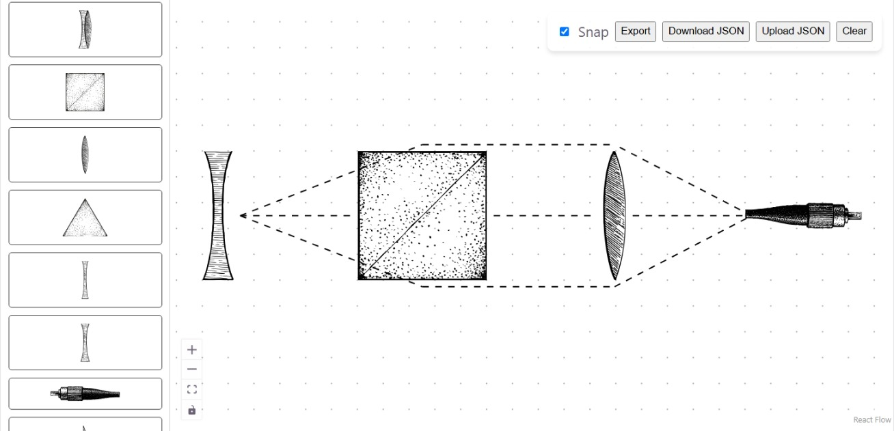

# Vingram

Ever feel the need to make diagrams that look like drawings in old science textbooks? Vingram is a React-based diagramming tool that allows you to create diagrams with that hand-drawn aesthetic. Kind of like diagrams.net, but vintage (hence the name). It uses SVG shapes and provides a simple interface for creating and connecting nodes, as well as features like snapping to a grid and the ability to add custom shapes.



## Features

- Create nodes with custom SVG shapes
- Connect nodes with edges
- Grid and rotation snapping for precise placement
- Auto-save your diagrams in the browser's local storage
- Export your diagrams as PNG or SVG files

## Credits

- [AstroLens](https://https://astrolens.net/) for the idea and the hand-drawn SVG shapes
- [React Flow](https://reactflow.dev/) for the underlying diagramming framework
- [Hack Club Horizons](https://horizons.hackclub.com/) for the motivation to finally get my lazy self to make this project

## Local setup

First, clone the repository:

```bash
git clone https://github.com/iqnite/vingram.git
cd vingram
```

Then, install the dependencies:

```bash
npm install
```

To start the development server, run:

```bash
npm run dev
```

## AI Usage

Since this is the first time I am using React, I used Gemini 3.1 Pro to get help with some of the React code, debugging, and understanding React Flow. In some parts, snippets were generated by AI or copied from tutorials, but those areas were thoroughly reviewed by me.

Every UI and structural decision was taken by me. Neither the graphical assets nor this documentation were generated by AI.
